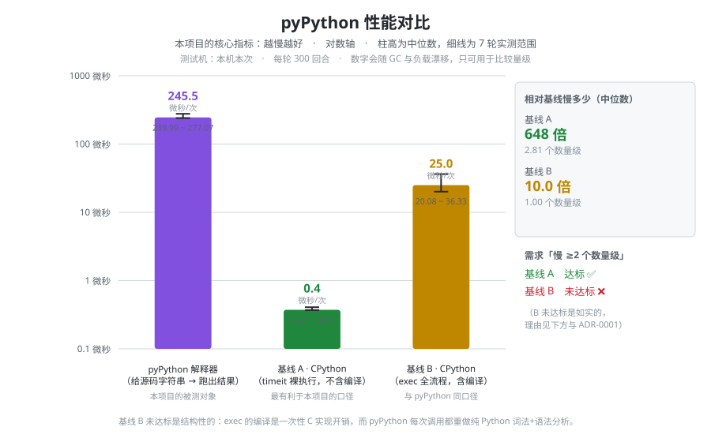

# pyPython IDE

[](https://github.com/Agying3/pyPython/actions/workflows/test.yml)
[](LICENSE)

> **想看完整文档?** `wiki/` 目录下有成套的说明:
> 语言参考 / 三值逻辑 / 实现原理 / 性能 / 踩坑记录 / 已知限制。
> 本 README 是速查表,`wiki/` 才是正片。

## 它有多慢

**核心指标:越慢越好。** 图里画的是中位数 + 实测范围(不是一根精确的柱子,
理由见 [wiki/性能](wiki/性能.md)):



| 基线 | 口径 | 倍数 | 达标(要求 ≥2 个数量级) |
|---|---|---|---|
| **A** | `timeit` 只算执行 | **686 倍**(2.84 个数量级) | ✅ |
| **B** | `exec` 全流程,含编译 | **12.1 倍**(1.08 个数量级) | ❌ **没达标** |

**两个都报,包括没达标的那个。** 基线 A 是最有利于本项目的口径,
基线 B 是公平口径——它没达标,因为 `exec` 的编译是一次性 C 实现开销,
而 pyPython 每次调用都重做纯 Python 的词法+语法分析。

本项目的口号是"不追求正确,只追求过程",但**测量不打算造假**。
见 [ADR-0001](docs/decisions/0001-pyPython-宿主与定位.md)。

图由 `python tools/make_perf_chart.py` 生成,**纯标准库手写 SVG**——
画个图就引 matplotlib 会违背"无第三方库"这条硬约束。

## 怎么打开

在项目根目录下,任选一条:

```
python pypython_idle_start.py                开一个空白编辑器
python pypython_idle_start.py 你的文件.pypy   打开指定文件
python -m pypython_idle                       等价,需要先 cd 到项目根
```

**推荐第一条** —— 它不要求当前目录在哪,直接跑就行。

启动后应该看到:

- 一个**空白**编辑器窗口,标题 `untitled (pyPython)` —— 就是新建文件的样子
- 菜单栏跟 IDLE 一样
- **没有**输出面板(跑完代码之后才会出现)

标题里的 `pyPython` 是替掉宿主 Python 版本号的位置。原版 IDLE 这里写 `3.13.12`,
容易让人以为自己在写 Python。

想看点东西跑起来,把 `examples/hello.pypy` 的内容复制进去,或者:

```
python pypython_idle_start.py examples\hello.pypy
```

## 三个功能怎么用

| 操作 | 效果 |
|---|---|
| **F5** | 运行编辑器里的全部代码,结果显示在输出面板(面板这时才出现) |
| **Tab** | 补全变量名 / 关键字 / 类名 / 函数名(`if` `while` `for` `def` `class` `「` `」` `$(`) |
| 打 `$(`, `「`, `"`, `[` | 弹出对应的 pyPython 语法卡片 |
| 在 `while`/`for`/`def`/`class` 行尾按回车 | 自动缩进一层 |

## 语言速查

```
a「1」              赋值(用 「」 代替等号,变量自动创建)
$(a)               输出(用 $() 代替 print)
~  ·               等于 / 不等于(同一个键,中文输入法下容易打反)
>  <               大于 / 小于
(a + b) 2          并排即相乘 = (a+b)*2,只在括号内生效
[1, [2], "x"]      列表,可嵌套可混类型
"abc" + "def"      字符串拼接,只能用双引号
if a ~ 1           缩进划块,没有冒号,没有分号
    $(42)
else
    $(0)

中文「42」           变量名可以用中文
$(中文)
```

### 第二版新增:循环、遍历、函数、类

```
while i < 3        循环
    i「i + 1」

for v in [1, 2]    遍历。可以遍历列表、字符串、字典,没有 range()
    $(v)

def 加(a, b)        函数。参数没有默认值
    return a + b
$(加(3, 4))         输出 7

def 数到(n)          可以递归,但有深度上限(120 层)
    if n < 1
        return 0
    return 数到(n - 1)

class 点            类
    def __init__(x, y)      构造器叫 __init__
        self.x「x」           self 不用写进参数表
    def 长度()               照 Python 习惯写 self 也行
        return self.x + self.y
p「点(1, 2)」        直接调类名就是建对象
$(p.长度())          输出 3
```

### 第三版新增:下标、字典、逻辑运算、循环控制

```
xs[0]  xs[-1]      下标。列表按位置,-1 是最后一个
xs[1]「99」         下标也能赋值
m[0][1]            下标可以嵌套

{「"a"」: 1}        字典。key 用 「」 包起来,冒号是本语言唯一的冒号用法
d「{}」             空字典
d["a"]             按 key 取值(没有这个 key 会报错)
d["b"]「2」         新增一项

a and b           逻辑运算用单词,不用 && || !
a or b             会短路,返回决定结果的那个操作数
not a              (不是 1/0)

break              跳出最内层循环。只能写在循环里,写在循环外解析期就报错
continue           跳到下一轮。函数体里的 break 不会打断调用方的循环
```

**`return` 可以省略**(省略时返回 0)。
**仍然没有**:切片、`while ... else`、异常、`lambda` / `import`、继承、`range()`。
字符串也不能用 `[]` 取字符(想按字符走请用 `for c in "..."`)。

### 第四版新增:三值逻辑(真 / 假 / 未知)

**这是这门语言唯一一个别处没有的东西。** 布尔有三个值,不是两个:

| 值 | 含义 |
|---|---|
| `TRUE` | 已观测,为真 |
| `FALSE` | 已观测,为假 |
| `MAYBE` | **尚未观测** |

`未知` 不是 `None`,不是错误,不是随机数。它是"消息发出去还没回"——
没回不等于失败,也不等于成功,它就是**还没被观测**。

```
x「未知」
$(x)               输出 MAYBE ⟨MAYBE⟩
```

**真值表(Kleene)**:确定的一方能压过未知,不确定的一侧压不过去。

```
$(x and 1)         未知。真 且 未知 = 未知
$(x and 0)         0   。假 且 未知 = 假     ← 假能压过未知
$(1 or x)          1   。真 或 未知 = 真     ← 真能压过未知
$(0 or x)          未知。假 或 未知 = 未知
$(not x)           未知。取反不产生信息
```

**未知会传染**:参与任何运算,结果都还是未知。

```
$(x + 1)           未知
$(x > 1)           未知
$((x + 1) > 0)     未知
$([x][0])          未知(存进容器再取出来,也还是未知)
```

**`if` 碰到未知:两边都不执行。**

```
if x
    $(1)           ← 不执行
else
    $(2)           ← 也不执行
```

只往账本记一笔,不报错、不随机、不跳过:

```
炑:静默观测已触发(第2行),状态未知,未执行任何分支。
      未知来源:x
      传染情况:未传染(未知到此为止)
```

**`while` 碰到未知**:不进循环体,记一笔账后退出。

**为什么不随机挑一边**:底层是二进制机器,任何随机都是伪随机。
用伪随机冒充未知,等于把"我不知道"偷偷换成"我掷了个骰子"——
那是撒谎。**不确定就一路传下去,不替用户做判断。**

**账本记三件事**(每次静默观测):哪个变量是未知、哪一行碰到了它、
这个未知有没有传染到后面的运算。

**未知身上带污染标记(taint),所以能真溯源**——标记跟着值走,
跨赋值、跨容器、跨函数都活着:

```
x「未知」
y「x + 1」
z「y * 2」
w「z - 3」
if w
    $(1)          不执行
else
    $(2)          也不执行
```

```
炑:静默观测已触发(第5行),状态未知,未执行任何分支。
      未知来源:w
      传播路径:x → y → z → w
      传染情况:未传染(未知到此为止)
      提示:若要确定分支,先给 x 赋一个确切的值;……
```

注意提示指向的是**源头 x**,不是中间环节 w——w 是算出来的,
给它赋值盖不住 x。

**两个独立来源不会被画成一条因果链:**

```
a「未知」
b「未知」
c「a + b」
if c            →  传播路径:a → c 与 b → c
```

因为 a 和 b 毫无关系,写成 `a → b → c` 就是撒谎。

标记存在**编码**里(`Tx>y|N:5`),所以过 Registry 也不丢。
没污染的值编码**完全不变**,旧行为一点没动。

`python pypython.py` 的**用例 4** 会把这六段演示连账本原文一起打出来,
可以直接肉眼确认。

**改名说明**:真值密室里原来那个叫 `MAYBE` 的档位(含义是"数字在 0 和 1 之间")
已改名 `LIMBO`——`MAYBE` 这个名字让给"未观测"了。所以 `$(0.5)` 现在输出
`0.5 ⟨LIMBO⟩ 0b0`。逻辑没变,只是换了名字。见 `docs/decisions/0009`。

**作用域按 Python 来**:函数里赋值默认建**局部**变量(所以递归正常),
想改全局要显式声明:

```
g「1」
def 改()
    全局 g「999」
改()
$(g)               输出 999
```

改语言之前**必读** `docs/decisions/0007` 与 `0008` ——
关键字表在 8 个地方各有一份,漏改一处不会报错,只会静默失效。

第三版起这几张表**语义分叉**了,不能无脑同步:

- `and` / `or` / `not` 要**高亮和补全**,但**绝不能**进
  `STATEMENT_KEYWORDS`(否则 `if not x` 会被当成新语句开头)
- `break` / `continue` 要**高亮和补全**,但**绝不能**进
  `PYPYTHON_BLOCK_OPENERS`(否则写完 `break` 按回车会多缩进一级)
- `break` / `continue` **反而必须**进 `pyparse._closere`(它们是块结束语句)

第四版只加了 `未知` 一个关键字,但它同样分叉:

- `未知` 要**高亮和补全**,但**绝不能**进 `STATEMENT_KEYWORDS`
  (它是**值**,不是语句,加进去会破坏 `if 未知`)
- `未知` **也绝不能**进 `PYPYTHON_BLOCK_OPENERS`(它不是块的开头)
- `未知` 必须是**关键字**而不是普通变量名——否则用户一句 `未知「5」`
  就能把"未观测"这个状态覆盖掉

`tests/test_keyword_sync.py` 会逐项检查这些,包括反向断言("某某不该在哪张表里")。

**注意**:`~` 和 `·` 在同一个键上。打反了**不会报错**(两个都是合法运算符),
只会算错。这是已知设计,见 `docs/decisions/0002`。

变量名支持中文,也支持 `_` 和数字(不能数字开头)。见 `docs/decisions/0006`。

## 两个 IDE 版本

项目里有两套 IDE 实现,**都能用,互不冲突**:

| 版本 | 启动方式 | 说明 |
|---|---|---|
| **源码改造版** | `python pypython_idle_start.py` | 把 IDLE 源码抓进项目改的,不依赖系统 IDLE |
| 运行时代理版 | `python pypython_ide.py` | 单文件,运行时替换 IDLE 的类属性 |

改造版更彻底(自带全部 IDLE 源码),代理版更轻(单文件)。

## 已知问题

启动和退出时,stderr 可能出现:

```
warning: callback failed in WindowList <class '_tkinter.TclError'>:
invalid command name ".!menu.window"
```

**这不是本项目引入的。** 已用**原生 IDLE** 复现确认:
不装 pyPython、不碰本项目任何代码,原生 IDLE 同样报这条警告。
它来自 `idlelib/window.py` 的窗口列表回调,属于 IDLE 自身的边界情况。

**其他已知限制:**

- `·`(不等于)和 `~`(等于)在同一个键上。**打反了不报错**,只会算错
- 统计里的 `verdict_of_last` 是"最后一个 `if` 的判定",不是"最后输出的真假"。
  程序里没写 `if`,它就一直显示 `FALSE`
- 从文件打开**只认编码是 UTF-8** 的源文件(跟 IDLE 原版一致)

## 目录说明

```
pypython.py              解释器本体(与 IDE 无关,可单独用)
pypython_idle/           源码改造版 IDE(60 个模块从 idlelib 抓来改造)
  startup.py               启动装配(复刻 pyshell.main 但不开 Shell)
  pypython_editor.py       主编辑器窗口
  colorizer.py             语法高亮(已改造)
  autocomplete.py          Tab 补全(已改造)
  calltip.py               语法提示(已改造)
  pyparse.py               自动缩进(已改造)
  runscript.py             F5 运行(已接 pyPython 解释器)
  upstream-docs/           (无此目录)上游文档必须留在包根,见下
pypython_ide.py          运行时代理版 IDE
interpreter.py           早期的正经计算器解释器(已搁置)
examples/hello.pypy      可运行示例(含全部四版语法)
tests/                   回归测试,`python tests/run_all.py` 一把跑完(12 个脚本)
tools/                   维护工具(出性能图;同样不依赖第三方库)
.github/workflows/       CI 配置(见下)
docs/decisions/          架构决策记录(9 篇 ADR)
wiki/                    完整文档(语言参考/三值逻辑/实现原理/性能/踩坑…)
LICENSE                  WTFPL v2(整份就一条:你他妈想干嘛就干嘛)
```

**注意**:`pypython_idle/` 里的 `help.html` / `CREDITS.txt` / `README.txt` /
`ChangeLog` 等文件**不能挪走** —— `help.py` 和 `help_about.py` 会在运行时读它们
(菜单的 Help / About 靠这个)。看着像没用的上游遗留,其实在用。

## CI

每次 push / PR,GitHub Actions 会在**一台干净的 Linux 机器**上把 12 个
脚本全跑一遍,横跨 Python **3.12 / 3.13 / 3.14**。上面那个绿色徽章就是它。

**为什么这个项目特别需要 CI:** 本项目的风险几乎全是**静默失效** ——
关键字表 8 份副本漏改一处、装饰性调用链接错一环,**都不报错**,
只是安静地不干活。这种 bug 在开发机上永远测不出来,因为开发机
"什么都装好了、目录刚好叫那个名字"。

CI 的作用就是打破这类假设。它已经抓到过一次:12 个测试脚本原先都写死了
`H:\pyPython`,CI 上一跑就 `ModuleNotFoundError`。

配置在 `.github/workflows/test.yml`,分两段:

| 段 | 内容 | 为什么要分开 |
|---|---|---|
| 解释器(9 个脚本) | 纯计算,不开窗口 | 失败早停 |
| IDE(3 个脚本) | 真开 Tk 窗口 | Linux runner 没显示器,要套 `xvfb-run` |

`test_keyword_sync.py` 虽然 import 了 IDE 的模块,但全程不建窗口,
所以留在第一段 —— 这是实测确认的(用猴子补丁盯着 `Tk()` 构造函数)。

## wiki 同步

`wiki/` 是源,推上去的是 [GitHub wiki](https://github.com/Agying3/pyPython/wiki)。

两条路:

```
python push_wiki.py            # 手动推(现在就可用)
```

改 `wiki/` 并 push 到 master 时,**CI 会自动推**(`.github/workflows/sync-wiki.yml`)。

**但自动同步现在没启用**,因为它需要一个 PAT:

> **实测结论**:默认的 `GITHUB_TOKEN` **推不了** wiki。
> wiki 是一个**独立的 git 仓库**(`Agying3/pyPython.wiki.git`),
> 而 `GITHUB_TOKEN` 只对当前仓库有写权限。实测结果是:
> `remote: Permission to Agying3/pyPython.wiki.git denied to github-actions[bot].`(403)。
> 它能 **clone**(11 页都读得到),但**推不上去**。

想启用:生成一个 PAT(细粒度选 Contents 读写,或 classic 勾 `repo`),
存成仓库 Secret,**名字必须叫 `WIKI_TOKEN`**。没配的话那个 workflow
会打印一句说明然后**正常退出,不报错** —— 没配可选功能不该让 CI 变红。

## 许可

**WTFPL v2** —— *DO WHAT THE FUCK YOU WANT TO PUBLIC LICENSE*。

```
0. You just DO WHAT THE FUCK YOU WANT TO.
```

整份协议就这一条。不要求署名、不要求开源、不要求保留版权声明,商用闭源都随意。
见 `LICENSE`。

选它的理由和这个项目一致:**别的协议都在替用户做判断,这个不做** ——
跟三值逻辑碰到 `未知` 时不替用户选分支,是同一条原则。

(提醒:WTFPL 未获 OSI 认证,GitHub 识别得出 `WTFPL` 这个 SPDX 标识,
但严格场合可能不被接受。要正规场合用,换 `MIT` 即可。)

## 决策记录

改这个 IDE 之前建议先读 `docs/decisions/`:

- **0002** 语言为什么长这样(语法简化,实现不简化)
- **0004** IDE 为什么寄生 IDLE 而不是手搓,以及 `#I1`–`#I26` 问题记录
- **0005** 两版为什么并存,以及改造踩过的坑
- **0007** 第二版语言构造(while/for/def/class),以及 6 份关键字副本的同步清单
- **0009** 第四版三值逻辑(真/假/未知)、静默观测账本、以及 `MAYBE`→`LIMBO` 改名

其中最重要的一条经验:改这个代码库时,**"看起来该改的名字"常常不是真正被读的那个**。
已经栽过 8 次(`make_pat` / 模块级 `prog` / `FileList.EditorWindow` /
`_windowlist` / `trans` 表 / `_chew_ordinaryre` / Help 用的 `help.html` /
`RE_IDENT` 与扫描器不一致),
每次都不报错。**读源码找真正的读取点,不要猜。**

第二条经验:**验收必须覆盖所有入口路径**。曾经只测"新建窗口"就宣布完成,
而"打开文件"那条路的高亮整个是坏的 —— 那是用户最常用的路径。

第三条经验:**API 反复测不出预期时,先怀疑自己的调用姿势**。
第二版开发中 `is_block_opener()` 连试三种参数都返回 `False`(连 `if` 都是),
看着像产品坏了,实际是测试喂错了 offset。改用真实编辑器端到端验证后立刻通过。
另外还有三处"失败"其实是测试自己写错了(构造器少一个下划线等)。
**报告失败之前,先确认测试测的是不是你以为的那件事。**
